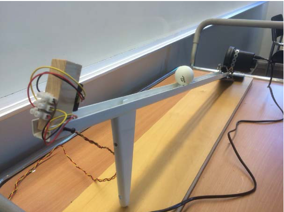
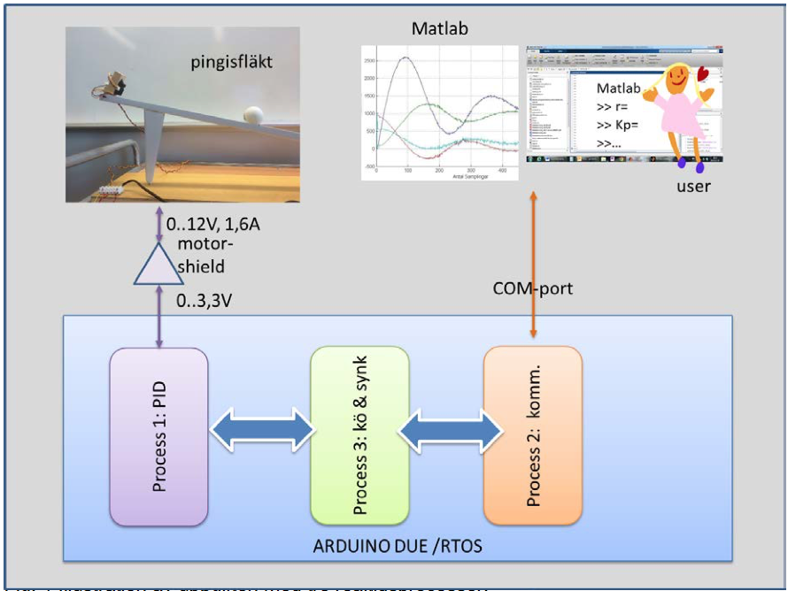

Inbyggda system och signaler - Examinationsprojekt
======
DA264 provkod 1506  
VT 2016

Syftet med examinationsuppgiften
------
Syftet med examinationsuppgiften är att studenten genom tillämpning av kunskaper, färdigheter och värderingsförmåga visar att hen har uppnått följande av kursens lärandemål:

**LM1** funktion och programmering av avancerade mikroprocessorsystem

**LM2** realtidsaspekter i samband med inbyggda system

**LM3** grundläggande teori inom signalbehandling, filterdesign och reglerteknik

**LM4** användning av typiska sensorer i mobila enheter och signalbehandling med mikroprocessor

**LM5** använda moderna utvecklingshjälpmedel för programutveckling för inbyggda system

**LM6** självständigt konstruera och testa programvara för inbyggda system innefattande parallella aktiviteter, digitala filter och regleralgoritmer

**LM7** integrera olika delar av ett inbyggt system till ett fungerande autonomt system

**LM8** kritiskt förhålla sig till innehåll i litteratur, teknisk dokumentation, marknadsföringsmaterial och material på internet

Kriterierna för bedömningen och betygsättningen finns i kapitlet ”Betyg”.

Uppgiftsbeskrivning
------
En PID-reglering av en fläkt som håller en pingisboll på en konstant avstånd på det sluttande planet (se figuren ovan) ska implementeras som ett C-program som exekveras på Arduino Due-kortet. Programmet ska realiseras med minst två parallellt exekverade och med varandra synkroniserade processer som löser följande uppgifter:

- Process 1 med högsta prioritet genomför själva PID-reglering av fläkten. Samplingen ska schemaläggas med RTOS med en periodicitet som ligger mellan 50ms – 100ms.

- Process 2 med lägsta prioritet hanterar överföringen av variabler mellan Matlab och Arduinon via seriella COM-porten (USB). Man ska i Matlab kunna ange börvärden samt PID-variablerna KP, TI, TD och samplingstiden. Samtidigt ska resultatet av regleringen visas som graf i Matlab med styrvärdet, felvärdet, och mätvärdet för distansen mellan pingisbollen och sensorn i realtid.
sida 2
	- Process 2 kan också delas upp i två processer. Första process hanterar COM-porten och kommunikationen och process 3 köhanteringen av mätvärden från PID- processen som ska skickas till Matlab samt synkronisering mellan regleringen och kommunikationen.

Problem som behöver lösas
------
För att kunna lösa uppgiften måste olika delar realiseras och integreras med varandra. Några delar har redan tagits fram i tidigare labbuppgifter, för andra finns att få inspiration från existerande lösningar. En genomgång av PWM-styrningar, av det realtidsoperativsystemet ”FreeRTOS” och olika regleralgoritmer ges i kursen.

Kommunikationen mellan Matlab och Arduinokortet kan inspireras av lösningen som vi har använt oss i laborationerna. Studera tillståndsmaskinen som Arduinoprogrammet adiosrv.pde och Matlabprogrammet arduino.m realiserar.

Signalerna behöver anpassas mellan processen och mikroprocessorkortet. Arduino Due kortet körs med 3,3V. Kortet förstörs om mer än 3,3V ansluts till ingångarna, dessutom är kortets analoga utgångar begränsade till 3,3V och 50mA. Det kommer inte att räcka för att driva fläkten som kräver 0-12V och 1,6A (se tabellen på its learning med mätningar av fläkten). Distanssensorn drivs med 5V. Enligt datablad ligger signalen och därmed ingången till Arduino mellan 0 – ca 3,5V. För att kunna styra fläkten har vi köpt in Arduinos motor- shield som tillåter att ansluta och styra en extern spänningskälla (t.ex. från en ”power box”).

Databladet av distanssensorn finns på its learning. Kurvan är ganska så olinjär. Välj därför ett arbetsområde som är enkel att linjärisera. Signalen behöver dessutom filtreras för att kunna bli användbar i en reglering och underlätta för regleralgoritmen genom att omvandla A/D-värdet till något vettigt. (Börja med att ta reda på hur sensorn fungerar samt hur signalen behöver behandlas innan ni sätter igång med en reglering).

Programmeringen i C delar upp sig i olika delproblem. Börja med att definiera och schemalägga de parallella processerna. C-programmeringen av själva PID-regulatorn ska inte vara några problem. Kommunikationen via Com-porten är antagligen krångligare. Kolla på exemplen som finns utlagda på It's Learning om hanteringen av USB-porten och på tillståndsmaskinen för kommunikationen som Mathworks använder. Att synkronisera de olika processer som behöver använda com-porten samt överföringen av värden och variabler mellan dem får inte heller glömmas bort.

Integrationen av olika delar och processer dvs. av hårdvara och mjukvara kan också alltid ställa till det. Ett bra sätt att minimera oförutsedda överraskningar är att använda sig av test-driven development (”TDD”).

Genomförandet och samarbete
------
Ni får arbeta ensam eller i grupper av maximalt _två_ studenter för att lösa uppgiften. Om ni arbetar tillsammans ska ni dela upp problemen som beskrivs ovan mellan er. I den tekniska rapporten ska ni ange vem som var ansvarig för vilka problem. Båda studenter ska ändå vara insatta i alla delar.

Alla delar i rapporten ska vara framtagna av gruppmedlemmarna själva och beskrivna med egna ord, ni får alltså inte plagiera någon annans lösning.

I samband med slutredovisningen kommer examinatorn att ställa muntliga förståelsefrågor till individuella studenter för att försäkra sig att båda studenterna har uppnått lärandemålen.

Grupperna arbetar med en egen uppsättning av Arduino Due-kortet men behöver dela på fyra fysiska modeller av pingis-fläkt-processen med respektive motor-shields. Tänk på att de fysiska modellerna inte är helt identiska och att kalibrering av reglerparametrar kan skilja sig åt beroende på vilken modell man använder. **Man kan alltså inte flytta sin kod hur som helst mellan modellerna utan att kalibrera om den.**

Teknisk rapport
------
Studenterna ska dokumentera hur de har löst uppgiften genom att skriva en teknisk rapport. I rapporten ska varje student med egna ord beskriva hur de olika problemen har lösts som hen varit ansvarig för. Rapporten måste vara inlämnad innan deadline inför slutredovisningen av prototypen.

Slutredovisning av prototypen och komplettering
-----
Under slutredovisningen i slutet av krusen ska varje grupp demonstrera det inbyggda systemet tillsammans med pingis-fläkt-modellen. Examinatorn ska samtidigt ha fått tillgång till studenternas tekniska rapport. Det gäller att övertyga examinatorn att man har löst uppgiften samt uppnått lärandemålen.

Om inlämningen har mindre fel i sin lösning eller rapporten har några få delar som behöver förbättras kan man få komplettera inlämningen. Om det är fråga om större problem eller helt undermålig rapport måsta man redovisa på nytt vid nästa tillfälle.

Om man har fått kompletteringar ska dessa åtgärdas inom tre veckor. Missar man att komplettera i tid gäller nästa omexamination.

Betyg
-----
För att få godkänt krävs att alla lärandemål LM1-LM8 är godkända enligt kriterierna nedan:
 
 | Inte godkänd | 3 | 4 | 5
--- | --- | --- | --- | --- | ---
LM1 | Koden är inte exekverbar på mikroprocessorsystemet. | Processerna fungerar på mikroprocessorsystemet enligt beskrivningen i den tekniska rapporten. Koden är körbar och funktionell. | Koden är strukturerad och välkommenterad | Koden skall vara väl strukturerad med tydligt och logisk uppdelning i funktioner och källkodsfiler. Kopplingar mellan olika delar av koden skall ske på _konsekvent_ sätt.
LM2 | Programmen saknar hantering av realtidsaspekter. |  Processerna körs med hjälp av ett realtidsoperativsystem. | Realtidsaspekter beaktas i programmet. Det finns en diskussion om  val av tidskontanter i den tekniska rapporten. |  Schemaläggningen av processerna _beräknas_ att den fungerar (enligt t.ex. RMA) och baseras på mätningar eller uppskattningar av koden.
LM3 | Studenten saknar viktig förståelse av grundläggande teori inom signalbehandling och reglerteknik. Studenten kan inte förklara vilka parameterinställningar som ska väljas för att få olika resultat. | Studenten diskuterar aspekter ur reglerteori i samband med beskrivningen av lösningen i tekniska rapporten. | Prototypen implementerar en filtrering av sensorsignalen samt PID- regleralgoritmen med inställda parameter enligt tumregler. | Regleringen är stabil för olika börvärden och svänger in inom rimlig tid.
LM4 | Nivån av signalerna är inte anpassade till 3,3V mikroprocessor | Sensorerna är anpassade och ansluten till mikroprocessorn på ett korrekt sätt. In- och utgångar är korrekt definierade. | Processorn samplar på ett korrekt sätt och läser och skriver rätt ports. |Problemet har lösts utan att utrustning går sönder.  
LM5 | Studenterna har inte använt sig av Atmel Studio | Studenterna har använt sig av ATMEL studio | Studenterna kan använda sig av  utvecklingsmiljön för att leta fel i programvaran. | 
LM6 | Studenten har inte självständigt konstruerat och testat programvara för inbyggda system| Processerna exekveras parallellt och synkroniseras med varandra, variabler eller variabelvärden kan delas mellan processerna. Regleralgoritmen fungerar och utförs med en konstant och förinställd samplingstid. Lösningen som implementerades beskrivs i slutrapporten.
LM7 | Delarna (processerna) fungerar inte tillsammans, bara var för sig. | Prototypen fungerar autonomt med alla delar. Tekniska rapporten beskriver hur de olika delarna integreras med varandra.
LM8 | Studenten har tagit exempel från internet och/eller litteraturen utan att ange källor eller förklara varför. | Studenten har använt sig av litteratur, teknisk dokumentation och material på internet som refereras och tillämpas i tekniska rapporten.

För att få betygen 4 eller 5 måste alla kriterierna för dessa betyg uppfyllas.
